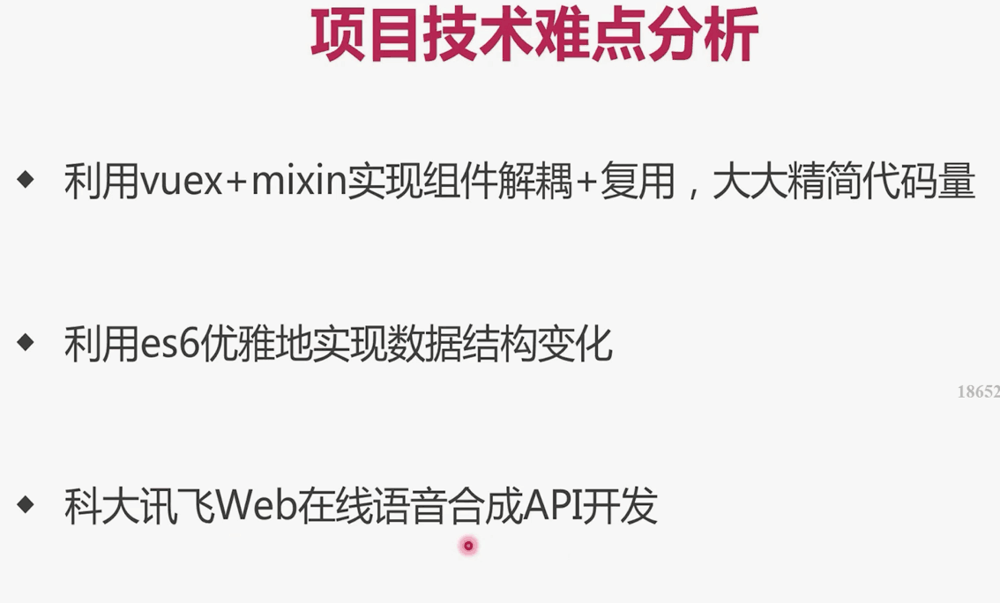
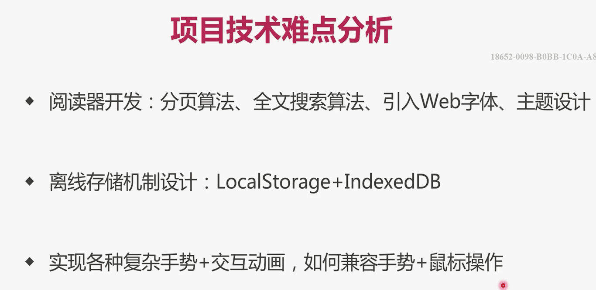
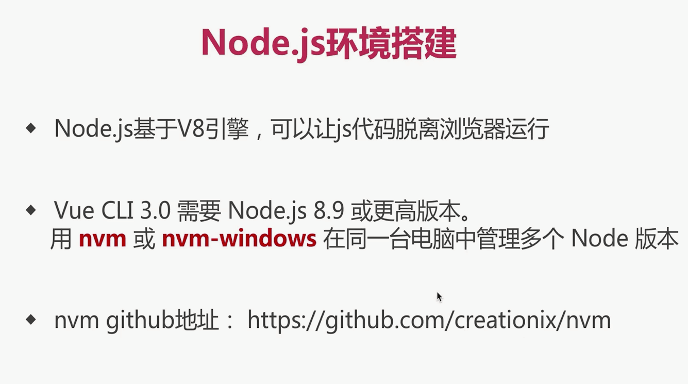
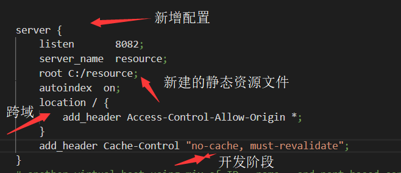
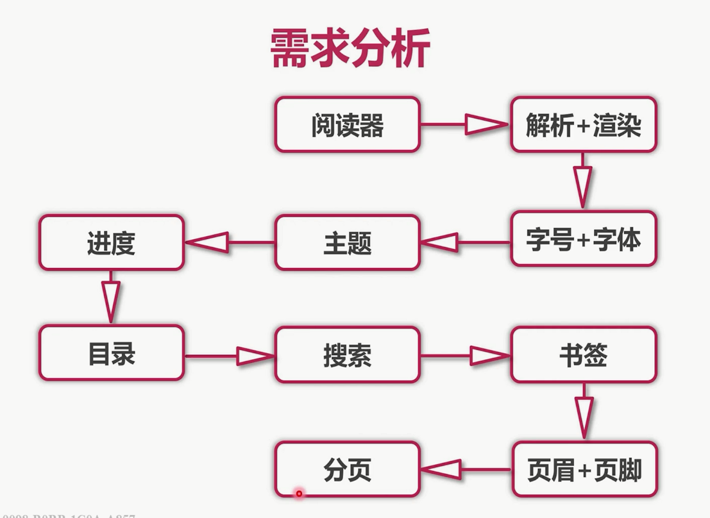

# vue-ebook

## Project setup
```
npm install
```

### Compiles and hot-reloads for development
```
npm run serve
```

### Compiles and minifies for production
```
npm run build
```

### Run your tests
```
npm run test
```

### Lints and fixes files
```
npm run lint
```

### Customize configuration
See [Configuration Reference](https://cli.vuejs.org/config/).

# 时间
>2019.5.12 17:10



# 关于epub
* cnpm i --save epubjs
```javaScript
import Epub from 'epubjs'
global.epub = Epub
```
# 关于语法检查
* 关闭缩进rules:`'indent': 'off'`
* 关闭函数后面的括号必须有个空格：`'space-before-function-paren': 'off'`
# 关于vue ui
* 可以看见项目插件、依赖、配置、任务
# 项目准备
## 图标准备
> 图标
* 浏览器工具书签有资料，这里存放在src->styles->fonts、icon.css
* src-main.js导入：`import './assets/styles/icon.css'`
* `<span class="icon-bookmark"></span>`就可看见图标
## 准备Web字体
* 浏览器工具书签有资料，这里存放在src->public->fonts
* 使用方式1（通过js引入）：(无效)
  * main.js：`import 保存某种字体的文件目录`
  * app.vue把需要改变的字体：css:font-family: 'Days One' // 字体名字
* 使用方式2（通过html引入）：
  * index.html文件导入：`<link rel="stylesheet" href="<%= BASE_URL %>fonts/daysOne.css">`
  * app.vue把需要改变的字体：css:font-family: 'Days One' // 字体名字
## 项目依赖包下载+项目配置
* scss:`cnpm i --save-dev node-sass sass-loader`
## viewport配置
> 不允许缩放：index.html
* <meta name="viewport" content="width=device-width,initial-scale=1.0,maximum-scale=1.0,minimum-scale=1.0,user-scalable=no">
## rem设置+自适应实现思路
> 引入rem
```javaScript
// app.vue
<script>
export default {}
document.addEventListener('DOMContentLoaded', () => {
  const html = document.querySelector('html')
  let fontSize = window.innerWidth / 10
  fontSize = fontSize > 50 ? 50 : fontSize  // 50px是上限
  html.style.fontSize = fontSize + 'px'
})
</script>
<style scoped>
.text {
  font-family: 'Days One';
  font-size: 1rem;
  color: pink;
}
</style>
```
> 再这基础上自适应布局：
```scss
// global.scss(全局样式文件)
$ratio: 375 / 10;
@function px2rem($px) {
  @return $px / $ratio + rem;
}
// app.vue
.text {
  font-family: 'Days One';
  font-size: px2rem(20); // 将上面的代码的1rem改为px2rem(20)
  color: pink;
}
```
* 这里$ratio值的设定是由用户决定的，可以根据自己的实际需要（或者UI设计稿）进行修改
* 这个值决定了px2rem输出的结果，如果设定为37.5，那么px2rem(20)，表示在375px宽度的屏幕下，显示为20px，计算方法如下：
* 第一步：375px宽度的屏幕，1rem=37.5px（因为在App.vue中指定了html的font-size=375px/10=37.5px，所以1rem=37.5px）
* 第二步：计算px2rem(20)=(20/37.5)rem
* 第三步：将rem转化为px：(20/37.5) * 1rem = 20/37.5 * 37.5px = 20px
* 如果屏幕为414px，那么px2rem(20)的计算结果为：
* px2rem(20)=(20/37.5)*41.4px=22.08px
* 从而实现了自适应布局，因为px2rem(20)会随屏幕宽度放大或缩小，这是一道数学题
* 直接输出结论：
  * 1、$ratio的值可以由用户随意设定
  * 2、当设置为37.5时，表示以屏幕宽度375px为基准
  * 3、如果屏幕宽度大于375px，使用px2rem()方法计算出的值会等比例扩大
  * 4、如果屏幕宽度小于375px，使用px2rem()方法计算出的值会等比例缩小

## global.scss和reset.scss
* global.scss作为唯一css入口文件
```
@import "./reset";
$ratio: 375 / 10;
@function px2rem($px) {
  @return $px / $ratio + rem;
}
```
* reset.scss是全局css默认样式
## 引入Vuex
# 搭建静态资源管理器

# 踩坑
>导入scss文件后随后的scss一直报错,原来是导入后面没加分号
>关于我对vuex的理解：
* mutations就是改变state里面的值而存在的，里面定义的函数传入的参数大部分都会是要改变成某某的值而存在的参数。然后就造成了其它组件引入，并且再把该参数commit传给vuex，继而改变state
```javaScript
mutations:{
    updateUserInfo(state,nickName){ // 用户名
      state.nickName = nickName
    },
    updateCartCount(state,cartCount){ // 用于更改购物车数量
      state.cartCount += cartCount
    },
    initCartCount(state,cartCount){ // 用于保存购物车数量
      state.cartCount = cartCount
    }
  }
```
# 阅读器开发
