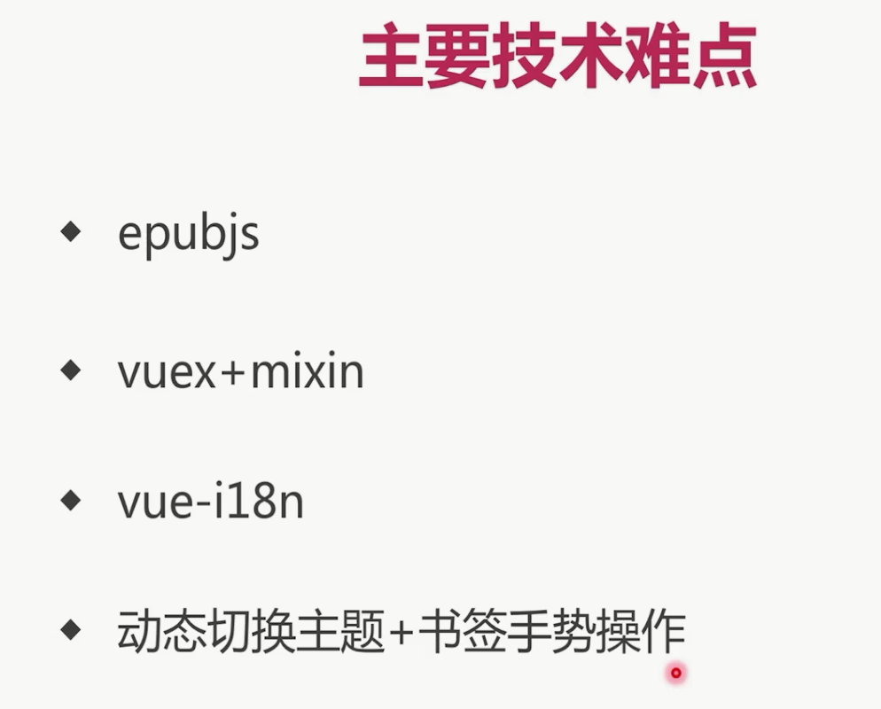

# vue-ebook

## Project setup
```
npm install
```

### Compiles and hot-reloads for development
```
npm run serve
```

### Compiles and minifies for production
```
npm run build
```

### Run your tests
```
npm run test
```

### Lints and fixes files
```
npm run lint
```

### Customize configuration
See [Configuration Reference](https://cli.vuejs.org/config/).

# 时间
>2019.5.12 17:10


# 插件：
* 安装localstorage库
  * `cnpm i --save web-storage-cache`
# 关于epub
* cnpm i --save epubjs
```javaScript
import Epub from 'epubjs'
global.epub = Epub
```
# 关于语法检查
* 关闭缩进rules:`'indent': 'off'`
* 关闭函数后面的括号必须有个空格：`'space-before-function-paren': 'off'`
# 关于vue ui
* 可以看见项目插件、依赖、配置、任务
# 项目准备
## 图标准备
> 图标
* 浏览器工具书签有资料，这里存放在src->styles->fonts、icon.css
* src-main.js导入：`import './assets/styles/icon.css'`
* `<span class="icon-bookmark"></span>`就可看见图标
## 准备Web字体
* 浏览器工具书签有资料，这里存放在public->fonts
* 使用方式1（通过js引入）：(无效)
  * main.js：`import 保存某种字体的文件目录`
  * app.vue把需要改变的字体：css:font-family: 'Days One' // 字体名字
* 使用方式2（通过html引入）：
  * index.html文件导入：`<link rel="stylesheet" href="<%= BASE_URL %>fonts/daysOne.css">`
  * app.vue把需要改变的字体：css:font-family: 'Days One' // 字体名字
## 项目依赖包下载+项目配置
* scss:`cnpm i --save-dev node-sass sass-loader`
## viewport配置
> 不允许缩放：index.html
* <meta name="viewport" content="width=device-width,initial-scale=1.0,maximum-scale=1.0,minimum-scale=1.0,user-scalable=no">
## rem设置+自适应实现思路
> 引入rem
```javaScript
// app.vue
<script>
export default {}
document.addEventListener('DOMContentLoaded', () => {
  const html = document.querySelector('html')
  let fontSize = window.innerWidth / 10
  fontSize = fontSize > 50 ? 50 : fontSize  // 50px是上限
  html.style.fontSize = fontSize + 'px'
})
</script>
<style scoped>
.text {
  font-family: 'Days One';
  font-size: 1rem;
  color: pink;
}
</style>
```
> 再这基础上自适应布局：
```scss
// global.scss(全局样式文件)
$ratio: 375 / 10;
@function px2rem($px) {
  @return $px / $ratio + rem;
}
// app.vue
.text {
  font-family: 'Days One';
  font-size: px2rem(20); // 将上面的代码的1rem改为px2rem(20)
  color: pink;
}
```
* 这里$ratio值的设定是由用户决定的，可以根据自己的实际需要（或者UI设计稿）进行修改
* 这个值决定了px2rem输出的结果，如果设定为37.5，那么px2rem(20)，表示在375px宽度的屏幕下，显示为20px，计算方法如下：
* 第一步：375px宽度的屏幕，1rem=37.5px（因为在App.vue中指定了html的font-size=375px/10=37.5px，所以1rem=37.5px）
* 第二步：计算px2rem(20)=(20/37.5)rem
* 第三步：将rem转化为px：(20/37.5) * 1rem = 20/37.5 * 37.5px = 20px
* 如果屏幕为414px，那么px2rem(20)的计算结果为：
* px2rem(20)=(20/37.5)*41.4px=22.08px
* 从而实现了自适应布局，因为px2rem(20)会随屏幕宽度放大或缩小，这是一道数学题
* 直接输出结论：
  * 1、$ratio的值可以由用户随意设定
  * 2、当设置为37.5时，表示以屏幕宽度375px为基准
  * 3、如果屏幕宽度大于375px，使用px2rem()方法计算出的值会等比例扩大
  * 4、如果屏幕宽度小于375px，使用px2rem()方法计算出的值会等比例缩小

## global.scss和reset.scss
* global.scss作为唯一css入口文件
```
@import "./reset";
$ratio: 375 / 10;
@function px2rem($px) {
  @return $px / $ratio + rem;
}
```
* reset.scss是全局css默认样式
## 引入Vuex
# 搭建静态资源管理器

# 踩坑
>导入scss文件后随后的scss一直报错,原来是导入后面没加分号
>关于我对vuex的理解：
* mutations就是改变state里面的值而存在的，里面定义的函数传入的参数大部分都会是要改变成某某的值而存在的参数。然后就造成了其它组件引入，并且再把该参数commit传给vuex，继而改变state
```javaScript
mutations:{
    updateUserInfo(state,nickName){ // 用户名
      state.nickName = nickName
    },
    updateCartCount(state,cartCount){ // 用于更改购物车数量
      state.cartCount += cartCount
    },
    initCartCount(state,cartCount){ // 用于保存购物车数量
      state.cartCount = cartCount
    }
  }
```
# 阅读器开发


## 路由
```javaScript
routes: [
  {
    path: '/',
    redirect: '/ebook'
  },
  {
    path: '/ebook',
    component: () => import('./views/ebook/index.vue'),
    children: [ // 子路由
      {
        path: ':filename', // 动态路由，接收filename
        component: () => import('./components/ebook/EbookReader.vue')
      }
    ]
  }
]
```
## epubjs
>引入epub
```
import Epub from 'epubjs'
global.epub = Epub
```
>配置电子书
```javaScript
export default {
  mounted() {
    this.$store.dispatch('setFileName', this.$route.params.fileName.split('|').join('/'))
      .then(() => { // 异步调用，所以用action
        this.initEpub()
      })
  },
  computed: {
    ...mapGetters(['fileName'])
  },
  methods: {
    initEpub() { // 初始化渲染电子书
      const url = 'http://localhost:8082/epub/' + this.fileName + '.epub'
      this.book = new Epub(url)
      this.rendition = this.book.renderTo('read', { // epubjs的方法，渲染图书的
        width: innerWidth,
        height: innerHeight,
        method: 'default' // 为了在微信上可以显示
      })
      this.rendition.display()
    }
  }
}
```
>关于翻转
* 手势触摸思想：
  * 利用epubjs提供的on方法，可以使用js提供的触摸事件，touchstart(开始触摸)，touchend(结束触摸)，另外触摸事件可以使用dom方法，如clientx,所以当结束触摸的位置>开始触摸的位置且过程小于500和滑动距离>50,证明是在向前滑动,于是启动向前滑动事件（epubjs提供了prevPage方法），同理向后滑动(nextPage方法）
```javaScript
  this.rendition.on('touchstart', event => { // 开始触摸
    this.touchStartX = event.changedTouches[0].clientX
    this.touchStartTime = event.timeStamp
  })
  this.rendition.on('touchend', event => { // 触摸结束
    const offsetX = event.changedTouches[0].clientX - this.touchStartX
    const time = event.timeStamp - this.touchStartTime
    if (time < 500 && offsetX > 40) { // 返回上一页
      this.prevPage()
    } else if (time < 500 && offsetX < -40) { // 执行下一页
      this.nextPage()
    } else {
      this.toggleTitleAndMenu() // 菜单展示/隐藏
    }
    event.preventDefault() // 禁止默认事件
    event.stopPropagation() // 禁止传播
  })
prevPage() {
  if (this.rendition) {
    this.rendition.prev()
  }
},
// 跳到下一页
nextPage() {
  if (this.rendition) {
    this.rendition.next()
  }
},
```
>关于设置主题：
```javaScript
function setTheme(index) {
  this.rendition.themes.select(this.themeList[index].name)
  this.defaultTheme = index
}
```
>关于注册主题：
```javaScript
function registerTheme(index) {
  this.themeList.forEach(theme => { // 注册样式
    this.rendition.themes.register(theme.name, theme.style)
  })
}
```
* 具体内容：
  * 当点击第index项的主题时，将themeList的index项的信息提取出来，将vuex的defaultTheme改变为index里的name,然后利用epubjs的select设置主题，并将主题名字保存在localStorage.
  * 在ebookReader里利用epubjs的register方法注册全部主题名字和样式，然后利用epubjs的select设置主题，避免刷新后在未设置主题时不给我之前的主题
```javaScript
// mixin.js
computed: {
  themeList() {
    return themeList(this)
  }
}

// ebookReader.vue
// 初始化主题
initTheme() {
  let defaultTheme = getTheme(this.fileName) // 从localStorage取出主题名字
    if (!defaultTheme) { // 如果本地存储没有存主题名字，将主题列表的第一个设为主题
      defaultTheme = this.themeList[0].name
      this.setDefaultTheme(defaultTheme) // 改变默认主题名字
      saveTheme(this.fileName, defaultTheme) // 存储名字
    }
  this.themeList.forEach(theme => { // 注册样式
    this.rendition.themes.register(theme.name, theme.style)
  })
  this.rendition.themes.select(defaultTheme)
},

// ebookSettingTheme.vue
setTheme(index) { // 设置主题
  const theme = this.themeList[index] // 取出相应的主题信息
  this.setDefaultTheme(theme.name).then(() => { // 改变默认主题为theme.name,
    this.currentBook.rendition.themes.select(this.defaultTheme) // 名字改了之后把这本书的主题给改了
  })
  saveTheme(this.fileName, theme.name) // 保存主题名称
}
```
> 关于菜单的主题颜色也改变：
* 因为改变主题颜色通过epubjs只能改变电子书主题，为了改变其他部分主题，使用动态添加link标签，将里面的href设为静态服务器上css文件的路径。
  * 通过addCss函数添加link,通过switch主题名字设置href的值传给addCss
  * 初始化调用，点击主题的时候调用，所以把addCss设为全局的方法放在book.js里，把switch主题名字设置href的方法放在了mixin.js里
* 因为每次点击主题都调用了addCss方法，所以定义一个全局清除link的方法,并在·把switch主题名字设置href的方法·最前面调用删除之前link的函数
* 详情参照util->book.js和mixin.js
* 由此可见参数的重要性，这里面要是没有设置参数href会很复杂，通过switch设置href这个操作是关键
>关于进度条
* html部分：type="range",@change,@input事件
``` html
<input class="progress" type="range"
@change="onProgressChange($event.target.value)" @input="onProgressInput($event.target.value)>
```
* js部分
```javaScript
methods: {
  onProgressChange (progress) {
    this.setProgress(progress).then(() => {
      this.displayProgress()
      this.updateProgressBg()
    })
  },
  onProgressInput (progress) {
    this.setProgress(progress).then(() => {
      this.updateProgressBg()
    })
  },
  displayProgress () {
    const cfi = this.currentBook.locations.cfiFromPercentage(this.progress / 100)
    this.currentBook.rendition.display(cfi)
  },
  updateProgressBg() { // backgroundSize设置为滑动位置至结束
    this.$refs.progress.style.backgroundSize = `${this.progress}% 100%`
  },
},
updated() {
  this.updateProgressBg()
}
```
>关于翻章节
```javaScript
preSection() { // 上一章
  if (this.section > 0 && this.bookAvailable) {
    this.setSection(this.section - 1).then(() => {
      this.displaySection()
    })
  }
},
nextSection() {
  if (this.section < this.currentBook.spine.length - 1 && this.bookAvailable) {
    this.setSection(this.section + 1).then(() => {
      this.displaySection()
    })
  }
},
displaySection () {
  const sectionInfo = this.currentBook.section(this.section)
  if (sectionInfo && sectionInfo.href) {
    this.currentBook.rendition.display(sectionInfo.href).then(() => {
      this.refreshLocation()
    })
  }
},
refreshLocation() {
  const currentLocation = this.currentBook.rendition.currentLocation()
  const progress = this.currentBook.locations.percentageFromCfi(currentLocation.start.cfi)
  this.setProgress(Math.floor(progress * 100))
}
```
> 分页算法
```javaScript
this.book.ready.then(() => {
  return this.book.locations.generate(750 * (window.innerWidth / 375) *
  (getFontSize(this.fileName) / 16)).then(locations => {
    this.setBookAvailable(true)
    this.refreshLocation()
  })
})
```
### 总结一下epubjs方法：
* 书定义：this.book = new Epub(url)
* 渲染书：this.rendition = this.book.renderTo('read',function{})
* 展示书：this.rendition.display()
* 监听书触摸事件：this.rendition.on
* 何时触摸：event.timeStamp
* 向前/后翻页：this.rendition.prev()，this.rendition.next()
* 设置字体：this.book.rendition.themes.fontSize(字体大小)
* 设置主题：this.book.rendition.themes.select(主题名字)
* 注册主题：this.book.rendition.themes.register(主题名字,主题样式)
* 设置字体样式：this.book.rendition.themes.font(字体样式名字)
* 改变字体样式之引入字体文件（只能放在我的enginx静态服务器下的一个文件夹里）：
```javaScript
this.rendition.hooks.content.register(contents => {
  Promise.all([
    contents.addStylesheet(`${process.env.VUE_APP_RES_URL}/fonts/daysOne.css`),
    contents.addStylesheet(`${process.env.VUE_APP_RES_URL}/fonts/cabin.css`),
    contents.addStylesheet(`${process.env.VUE_APP_RES_URL}/fonts/montserrat.css`),
    contents.addStylesheet(`${process.env.VUE_APP_RES_URL}/fonts/tangerine.css`)
  ]).then(() => {
    console.log('字体已经全部加在完毕')
  })
})
```
* 获取一级目录：this.currentBook.navigation.get(sectionInfo.href)
* 获取一级目录标题：this.currentBook.navigation.get(sectionInfo.href).label
* 图书观看百分比：cfi=this.currentBook.locations.cfiFromPercentage(this.progress / 100)
* 渲染指定地点的图书：this.currentBook.rendition.display(cfi)
* 图书所有章节详情：this.currentBook.spine
* 图书的第几章详情：const sectionInfo = this.currentBook.section(第几章)
* 某章图书的链接，href是一个html，如果加个display就渲染了这一章：this.currentBook.section.href
* 当前章节的详情：this.currentBook.rendition.currentLocation()
* 当前章节的开始页面：this.currentBook.rendition.currentLocation().start.cfi
* 当前页面位于全书的百分比：this.currentBook.locations.percentageFromCfi（某一章）
* 获取图书封皮:this.book.loaded.cover
* 获取图书作者：this.book.loaded.metadata.creator
* 获取图书名字：this.book.loaded.metadata.title
* 设置高亮: this.currentBook.rendition.annotations.highlight(target)
```javaScript
// 获取图书的基本信息
parseBook() {
  this.book.loaded.cover.then(cover => { // 图书封面
    this.book.archive.createUrl(cover).then(url => {
      this.setCover(url)
    })
  })
  this.book.loaded.metadata.then(metadata => { // 图书作者
    this.setMetadata(metadata)
  })
},
```
* 获取图书章节目录(是个数组)：this.book.navigation.toc
> vue中鼠标的‘enter箭’：`@keyup.enter.exact="search()"`,加exact为了防止同时按别的键也触发enter事件
## vuex+mixin
> 因为每个使用vuex的组件都需要引入{mapGetters} from 'vuex',并且整个计算属性存放state元素，为了代码复用，于是把这些代码抽象出来放在src->utils->mixin.js，然后各个组件只需引入该文件`import {ebookMixin} from '路经'`然后定义`mixins:[ebookMixin]`即可。此外，actions也同样此操作
> 因为有些样式想要弄成全局样式，利用scss的@mixin定义对象，调用某个对象的时候直接`@include 对象名`。 用@function定义函数，这里调用的时候直接`padding:px2rem(12)`
```
$ratio: 375 / 10;

@function px2rem($px) {
  @return $px / $ratio + rem;
}
@mixin center {
  display: flex;
  justify-content: center;
  align-items: center;
}
```
## vue-i18n国际化
* 安装：` cnpm i --save vue-i18n`
* import VueI18n from 'vue-i18n'
* Vue.use(VueI18n)
* main.js:
  * import i18n from './lang'
  * 在main.js的实例中挂载i18n
* 使用:`<span">{{$t('book.selectFont')}}</span>`
## 动态切换主题+字体+书签手势操作
> 字体：epubjs的方法：`this.book.rendition.themes.fontSize`
```
setFontSize(fontSize) { // 设置字体字号
  this.book.rendition.themes.fontSize(fontSize)
}
```
## 安装localstorage库
* `cnpm i --save web-storage-cache`
* 引包`import Storage from 'web-storage-cache'`
* 实例化对象`const localStorage = new Storage()`
```javaScript
// 写入数据
export function setLocalStorage(key, value) {
  return localStorage.set(key, value)
}

// 获取数据
export function getLocalStorage(key) {
  return localStorage.get(key)
}
// 获取缓存
export function removeLocalStorage(key) {
  return localStorage.delete(key)
}

// 清空
export function clearLocalStorage(key) {
  return localStorage.clear()
}
```
# 难点：
>做目录时，由于数组里面可能嵌套数组然后再嵌套数组，为了改成一维数组在显示目录时直接将不规则数组传进去就好了。其次这样全部拆成了一级目录，为了分配二级目录好设置css的margin，利用filter和epubjs的id,parent将多级目录形成新数组，并将多级目录的级数通过level计算
```javaScript
// 将多维数组转化为一维数组
// book.js
export function flatten(array) {
  return [].concat(...array.map(item => [].concat(item, ...flatten(item.subitems))))
}
// EbookMenu.vue
this.book.loaded.navigation.then((nav) => { // 获取到全书章节之后
  const navItem = flatten(nav.toc) // 被拆分的一级目录
  function find(item, level = 0) {
    // 当当前项的parent属性为underfind时（代表是一级目录epubjs给的）,level=0
    // 当当前项的parent存在时，代表不是一级目录。然后寻找满足其他数组的id和item.parent相等的的数组
    // 如果找到了就让当前项的level+1，并且让新找到的成立一个数组，然后继续找。。。
    return !item.parent ? level : find(navItem.filter(parentItem =>
    parentItem.id === item.parent)[0], ++level)
  }
  navItem.forEach(item => { // 遍历每一项，添加level
    item.level = find(item)
  })
  this.setNavigation(navItem)
})
```
> 关于等待目录渲染结束之前的loading:具体参照EbookLoading.vue
* 这里用了两个v-for,第一个v-for是指左右两边
* 第二个v-for包含在第一个里面，表示左边三个线，右边三个线
* 第二个v-for里面有无色线和白线
* 通过setInterval，设置动画时长，循环遍历每个无色线，通过add值和end值决定无色线的方向，通过增加、减少无色线与有色线长短造成动画视觉
* 为了使每个线与上一条线参差不齐的视觉感受，让上一条线无色线为8的时候才让下一条线开始动弹。
  * 注意多条判断决定走向方向以及是否到头以及是否为第一条线
> 关于书签
* 功能：在未设置书签时下拉屏幕时显示‘下拉添加书签’，当拉到一定高度时显示‘松开设置为书签’；在已设置书签时下拉屏幕时显示‘下拉删除书签’，当拉到一定高度时显示‘松开删除该书签’
  * 首先监听touchmove事件，获取手势移动的高度
    * 通过 `@touchmove="move"@touchend="moveEnd"`触发触摸事件，`e.changedTouches[0].clientY`获取触摸位置，声明一个变量，如果变量存在，就表示为第二次触摸的位置，不存在则存储位置
```javaScript
// ebookReader
// 下拉
    move(e) {
      let offsetY = 0
      if (this.firstOffsetY) { // 如果存在开始触摸的位置
        offsetY = e.changedTouches[0].clientY - this.firstOffsetY
        this.$store.commit('SET_OFFSETY', offsetY) // 保存下拉偏移量
      } else {
        this.firstOffsetY = e.changedTouches[0].clientY
      }
      e.preventDefault()
      e.stopPropagation()
    },

    // 下拉结束
    moveEnd(e) {
      this.$store.dispatch('setOffsetY', 0)
      this.firstOffsetY = null
    },
```
  * 当监听到手势事件时，需要对indexview进行移动,所以要将indexview整个绝对定位，下拉时改变他的top值 
```javascript
// index.vue
watch: {
  offsetY(v) { // 监听y轴变化 ------------------- 监听vuex里的值，v居然代表值
    if (v > 0) { // 如果下拉
      this.move(v)
    } else if (v === 0) { // 如果松手
      this.restore()
    }
  }
},
mounted() {
  this.startLoopReadTime()
},
methods: {
  restore() {
    this.$refs.ebook.style.top = 0
    this.$refs.ebook.style.transition = 'all 0.2s linear'
    setTimeout(() => { // 为了避免多次下拉时卡顿现象------------原来seTimeout还有这个功能
      this.$refs.ebook.style.transition = ''
    }, 200)
  },
  move(v) {
    this.$refs.ebook.style.top = v + 'px'
  },
```
  * 在顶部增加一个书签组件，向下时书签组件就会出现，并且该组件需要判断展示了多高，来进行字以及书签图标更改
# 坑
>为了其它组件获取这本书从而改变这本书下的一些样式，如字体大小，背景等，于是我在vuex定义了一个currentBook，设置了mutation,getter,action,并在初始化这本书的时候`this.setCurrentBook=this.book`,但是我在其它组件上调用currentBook的时候为空，vuex上也显示currentBook为空，于是找错
* 先从store下手，两天反复核对了好几遍没发现store有任何错误
* 于是console.log了很多setCurrentBook，current,current仍然为空。注意setCurrentBook是我action定义的方法。
* 想过重新建一个store2,但是由于原本代码封装性太强弄一下太麻烦，其实我误会了，很简单的，我的store文件夹有个book.js专门用来定义state和mutation,actions.js专门用来定义actions,getters.js专门用来定义getter的函数，然后这些文件导出并被index.js文件引用。为了实现代码简单，我又创建了minxin.js用来将ction,getter方法进行封装解构， 往下看
* 最终还是换了个简单的方法，不整封装了，直接`this.$store.commit('SET_CURRENT_BOOK', this.book),this.$store.dispatch('setCurrentBook', this.book)`就成功了，查看current的值也正确了。
* 至今不知道为什么封装的就不能改变current值,其他的值完全ok
* 最重要的是我找错步骤是不对的，当我未从store找到错误时，我应该换个方式改变currenBook的值，即原始方法弄，而不是继续通过封装的方式改变