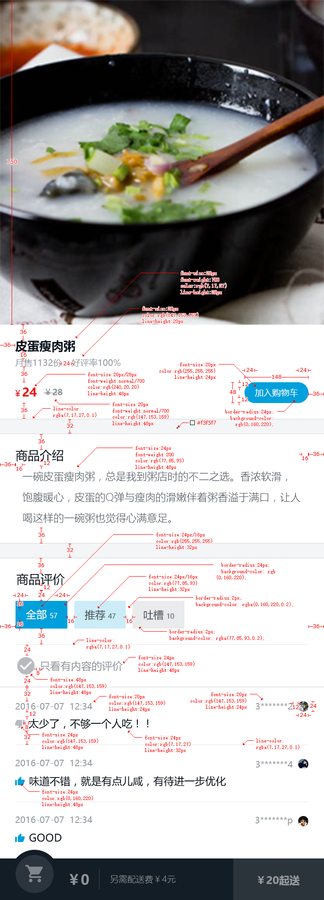

# 安装滴滴样式
# 增加data.json文件，在vue.config.js引入后台数据
# 更改index.html，给他添加meta属性不让页面缩放
# 增加在网站上生成的图片文件
# 增加基本样式文件、增加index.styl文件，把icon,base导入
# 在main.js中导入index.styl//报错
# 增加variable.styl，并在其中导入cube-ui.js,设置颜色样式
# 增加mixin.styl，并在其中导入cube-ui.js
# 创建v-header文件夹，加入vue文件和图片
# 在组件下建立存放图片的文件夹support-ico，添加图片和vue文件，文件定义了图标显示什么以及尺寸
# 整改vue.config,js,把路径整改
# get新技能
1. axios执行get请求，三种方式，这里用的是通过params对象传递参数，并做了封装。
```
api/helpers:
export function get(url) {//定义get方法
  return function (params) {
    return axios.get(url, {
      params
    }).then((res) => {
      const { errno, data } = res.data
      if (errno === ERR_OK) {
        return data
      }
    }).catch(() => {
    })
  }
}
api/index.js:
import { get } from './helpers'
const getSeller = get('/api/seller')//接受get方法
const getGoods = get('/api/goods')
export {
  getSeller,
  getGoods
}
app.vue:
 _getSeller() {
  getSeller().then((seller) => {
    this.seller = seller
  })
 }
```
2. css3 新特性backdrop-filter
  backdrop-filter: blur(10px)// 可以不使其子元素也继承模糊属性
> 它还有别的属性，可以设置动画 模糊颜色
3. 重新复习floor，ceil,向下向上计数。
* 星星个数计算想法： 设置一个数组，为了让数组前面的元素是亮的星星，把整颗亮星星个数计算出来，然后传入数组，在计算半颗星星传入数组，最后如果数组个数<5,把灭了的星星push进去
```
let score=Math.floor(this.score*2)/2;//0.5的倍数
let hasDecimal=score%1 !== 0;//说明有小数，有半星
```
4. 全屏弹窗之position:fixed
> fixed布局如果在一个组件内部嵌套的话，很容易遭受bug，诸如transition的影响，因此最好把全屏弹窗放在body下
* 引入cube-api 下的createAPI,不仅如alert一样稳定，而且会把组建放在body下
### 关于cube-api的createAPI介绍：
#### 该模块默认暴露出一个 createAPI 函数，可以实现以 API 的形式调用自定义组件。并且既可以在 Vue 实例上下文中调用，也可以在普通 js 文件中调用。
> 运用： 在需要运用全屏框的 组件上 添加点击事件，点击事件中运用createAPI:
```
const instance = this.$createAaBb(config, renderFn, single)。
代码：
showDetail() {
  this.headerDetailComp = this.headerDetailComp || this.$createHeaderDetail({
    $props: {
      seller: 'seller'
    }
  })
  this.headerDetailComp.show()
}
```
5. 利用cube-ui的tabBar，写滑动tab区域，用slide写可用手滑动翻页的区域。
### tab区域：
#### tab区域以及完成点击tab引起slide改变
> 思想： 单纯的tabbar只用把文档代码粘出来。但是我想在点击某一项tabbar时下面的slide随之改变。 于是看文档得知绑定一个 v-model，并且值必须是对应的label就可以完成切换。那么问题来了，怎样让tabbar改变时label也变呢？这时想到计算属性。
  * 把v-model的值绑定计算属性，其中get这个钩子函数用来读取当前label的值，计算并返回新的值。那么如何知道当前的label值呢，思路：由index得知label。由此用set这个钩子函数来监视index的变化，变化了咱们就执行get。那么set怎样改变index的值呢？官方文档有个value，value是cubeTab的参数之一，用来判断哪个tab的值作为选中值。默认值：label值。因此通过遍历tabs中value.label在数组中的位置来改变index
```
<cube-tab-bar
              v-model="selectedLabel" //必须项，该指令表示选中的是哪个tab,参数值必须与某一项tab的label属性对应。意思是值必须是对应的label值
              class="border-bottom-1px"
              :showSlider=true // 是否展示下划线
              ref="tabBar"
              :data="tabs"> // data是tabbar规定的一个数组类型用于传所要渲染的数据的，规定数组的每一项必须是一个对象类型，有一个默认的label，写数据的
</cube-tab-bar>
data () {
  return {
    index: 0,

    tabs: [
      {
        label: '商品'
      },
      {
        label: '评价'
      },
      {
        label: '详情'
      }
    ]
  }
}
computed: {
  selectedLabel: {
    get() { // 回调函数 当需要读取当前属性值是执行，根据相关数据计算并返回当前属性的值
      return this.tabs[this.index].label
    },
    set(newVal) { // 监视当前属性值的变化，当属性值发生变化时执行，更新相关的属性数据
      this.index = this.tabs.findIndex((value) => {
        return value.label === newVal // 官方文档有说明。value是cubeTab的参数之一，用来判断哪个tab的值作为选中值。默认值：label值
      })
    }
  }
},
```
### slide区域：
1. slide区域以及完成点击slide引起tab改变
> 思想：文档给出change事件，在slide页面切换时触发，参数：当前页面的索引值
  * 既然有change事件又有当前页面索引值作为参数，那么点击slide引起tab改变只用改变data中的index值就好了。因为index一旦改变，就会触发tabbar的model事件的计算属性，一旦触发计算属性，tabbar就会发生改变
```
onChange (current) {
  this.index = current // 更改当前索引值
  console.log(this.index)
}
```
2. 当slide滑动时让tabbar的底部横条也对应滚动一定距离
> 思想：文档 slide 给出*scroll事件*，在滚动中实时触发，参数：Object {x, y} -滚动位置的坐标值。那么可以设置滚动时改变横条的位置
  * 利用实时触发滚动的这个事件，设置底部横条位置。看文档得知tabbar有一个实例方法：*setSliderTransform*,改变 cube-tab-bar 组件的下划线的 transformX
```
onScroll (pos) {
  const tabBarWidth = this.$refs.tabBar.$el.clientWidth
  const slideWidth = this.$refs.slide.slide.scrollerWidth
  const transform = -pos.x / slideWidth * tabBarWidth
  /* setSliderTransform改变 cube-tab-bar 组件的下划线的 transformX，如果传 Number，
    会转成像素，也可以传带有单位的Number/String */
  this.$refs.tabBar.setSliderTransform(transform)
}
options: { // 实时派发滚动的距离
  listenScroll: true,
  probeType: 3,// 0 不派发scroll事件，1：非实时；2：滑动过程中；3：不仅在屏幕滑动的过程中，而且momentum 滚动动画运行过程中实时派发
  directionLockThreshold: 0 // 横向竖向滚动时避免斜向滚动。如果项目中只是一个方向滚动，那就不用设置，现在这个项目是俩个方向滚动，所以要设置为0
}
<!-- slide区域 -->
  <cube-slide
    ref="slide"
    :loop=false
    :initial-index="index"
    :auto-play=false
    :show-dots=false
    :options="options"
    @change="onChange"
    @scroll="onScroll"
  >
```
* 需要注意不管是点击tabbar还是滑动slide,都会引起页面的滚动，即都会触发slide滑动，这样会引起底部横条缓动异常，so,关闭tabbar的默认缓动，怎么关看tabbar文档。
### tab组件的抽象和封装
> 因为所有的数据都是直接写在tab组件，为了避免以后增加/减少tabbar导致tab组件的修改，需要对tab中的数据抽离出来，只留下功能代码
#### 动态组件
>   牵扯到tab的数据的封装,因此需要动态创建组件。动态组件概念：让多个组件使用同一个挂载点，并动态切换
  * 通过使用保留的 <component> 元素，动态地绑定到它的 is 特性，可以实现动态组件
```
<cube-slide-item v-for="(item,index) in tabs" :key="index">
  <component ref="component" :is="tabs.component" :data="tabs.data"></component>
</cube-slide-item>
```
4. scroll-nav组件
> 启用cube-ui中的ScrollNav，
```
<cube-scroll-nav
  :side=true // ScrollNav配置 设置为 true 代表是一个侧边样式效果；
  :data="goods" //  ScrollNav配置  默认传入的数据，这个数据会被传入内部使用的 cube-scroll 组件，当 data 发生变化时，scroll 组件会自动刷新；
  :options="scrollOptions" // 用于配置一些click、directionLockThreshold参数
  v-if="goods.length" // 为了避免数据浪费 详情请往下看
>
<cube-scroll-nav-panel // 该组件和cube-scroll-nav组件相辅相成
  v-for="good in goods" // 渲染从后台获取到的食物数据
  :key="good.name"
  :label="good.name" // ScrollNav配置 必须，面板的唯一标示的值(如热销榜)
  :title="good.name" // 面板标题内容，可以是 HTML 字符串
>
 (1)、options参数配置

scrollOptions: {
  click: false, // 会点击俩次，底层用的是scroll，所以设置click为false
  directionLockThreshold: 0
}
（2）、获取数据的方法为fetch
fetch () {
  getGoods().then((goods) => {
    this.goods = goods
  })
}
//什么时候调用呢？我们一般是在组件的mounted里面调用，但是在这个项目中，如果我们在评论或者商家页面，商品页面有可能是在mounted，这时就会进行数据加载，这样的话，会影响当前页面的显示，所以，我们应该在切换组件的时候调用这个方法
```
* 可以在Tab组件的onChange方法里调用：
```
// 切换的时候，调用对应组件里面的fetch
onChange (current) {
  this.index = current // 更改当前索引值
  const instance = this.$refs.component[current]
  if (instance && instance.fetch) {
    instance.fetch()
  }
}
```
5. 制作添加删除菜按钮
### vue中$set的使用
### 当从父组件中传来的food.count不存在时，点击"➕"按钮，使count+1
* 值得注意的是food在父组件的data中并没有count这个属性，对于响应系统，vue不会遍历count这个属性
> 解决方法： 通过Vue.$set方法设置data属性：
```
  add() {
    if (!this.food.count) {
      Vue.set(this.food, 'count', 1)
    }
  }
```
6. 实现小球飞入动画
> 效果：页面可以有多个小球飞入底部购物车。
#### 具体实现：
##### 1.首先在底部购物车组件通过*循环创建10个隐藏的小球*，目的是可以有多个小球在页面上运动。(通过js命名一个函数，函数返回存放小球的数组，然后在data中保存这个函数，并赋值给balls)
```
具体做法代码：
<!-- shop-cart.vue -->
const BALL_LEN = 10 // 小球个数
function createBalls () { // 将小球放在ret数组中，并且隐藏他们
  let ret = []
  for (let i = 0; i < BALL_LEN; i++) {
    ret.push({
      show: false
    })
  }
  return ret
}
data () {
  return {
    balls: createBalls()
  }
},
<!-- shop-cart.template -->
<div class="ball-container">
  <div v-for="(ball, index) in balls" :key="index">
    <transition
      @before-enter="beforeDrop"
      @enter="droping"
      @after-enter="afterDrop"
    >
        <div class="ball" v-show="ball.show">
          <div class="inner inner-hook"></div>
        </div>
    </transition>
  </div>
</div>
```
##### 2.点击goods组件上的加号，让小球显示出来并实现动画。
* 因为要知道小球运动前后落脚点，所以需要操作dom得知是哪个加号。于是cart-control向父组件goods传点击的dom
```
<!-- cart-control.vue -->
// 定义加入购物车
add(event) {
  if (!this.food.count) {
    this.$set(this.food, 'count', 1)
  } else {
    this.food.count++
  }
  this.$emit(EVENT_ADD, event.target) // 将点击的dom传给goods父组件
},
<!-- goods.vue -->
<div class="cart-control-wrapper">
  <cart-control :food="food" @add="onAdd"></cart-control>
</div>
onAdd (el) { // 点击加号，执行购物车子组件的drop事件，同时将el传给子组件，用于子组件操作小球动画
  this.$refs.shopCart.drop(el) // 操作购物车dom,执行子组件drop方法
}
```
##### 3.定义drop方法（在点击加号的时候把小球显示出来，并且把小球的el=传进来的加号的dom（我也不知道怎么可以这样神奇，可能我想错了吧），然后把显示的小球扔进dropBalls数组中，注意这个数组实在create生命周期定义，因为这是个临时数组，不用响应式）
```
drop(el) { // 接收从父组件goods传来的小球初始化位置的参数
  for (let i = 0; i < this.balls.length; i++) {
      const ball = this.balls[i]
      if (!ball.show) {
        ball.show = true
        ball.el = el
        this.dropBalls.push(ball) // 把显示的小球push进dropBalls去
        return
      }
  }
},
```
##### 4.发挥dropballs数组的时候到了——小球动画事件.
* 在beforeDrop中：把最后一个被点击的小球显示出来，并且把它挪到被点的加号dom位置处（注意这里用ball.el获取dom）
* 在droping 中，把小球挪到购物车位置，即原位置，注意这里的done结束动画
* 在afterDrop中，获取droopBalls中的第一个小球，如果该小球还在显示，那么隐藏它，注意还要使ball.show=false
```
beforeDrop(el) {
  const ball = this.dropBalls[this.dropBalls.length - 1] // 最后一个被点的小球
  const rect = ball.el.getBoundingClientRect() // 获取最后一个被点加号相对于屏幕的位置
  const x = rect.left - 32
  const y = -(window.innerHeight - rect.top - 22) // 为负 因为开始小球在购物车，我们要把小球挪到菜品的加号那
  el.style.display = ''
  el.style.transform = el.style.webitTransform = `translate3d(0,${y}px,0)` // y方向
  const inner = el.getElementsByClassName(innerClsHook)[0]
  inner.style.transform = inner.style.webkitTransform = `translate3d(${x}px,0,0)` // x偏移方向
},
  droping(el, done) {
    this._reflow = document.body.offsetHeight
    el.style.transform = el.style.webitTransform = `translate3d(0,0,0)` // y方向 滚回原来位置
    const inner = el.getElementsByClassName(innerClsHook)[0]
    inner.style.transform = inner.style.webkitTransform = `translate3d(0,0,0)` // x 向原来位置进发
    el.addEventListener('transitionend', done)
  },
  afterDrop(el) { // 结束动画，隐藏小球
    const ball = this.dropBalls.shift() // 获取到第一个小球
    if (ball) { // 如果存在显示的小球
      ball.show = false // 隐藏
      el.style.display = 'none'
    }
  }
},
```
7. 父组件触发子组件的方法：
* 子组件：
```
<template>
<div>
  child
</div>
</template>

<script>
export default {
  name: "child",
  props: "someprops",
  methods: {
    parentHandleclick(e) {
      console.log(e)
    }
  }
}
</script>
```
* 父组件
```
<template>
  <div>
    <button @click="clickParent">点击</button>
    <child ref="mychild"></child>
  </div>
</template>
 
<script>
  import Child from './child';
  export default {
    name: "parent",
    components: {
      child: Child
    },
    methods: {
      clickParent() {
        this.$refs.mychild.parentHandleclick("嘿嘿嘿"); // 触发子组件的方法
      }
    }
  }
</script>
```
8. 插槽
(https://blog.csdn.net/hani_wen/article/details/80805415)
9. 实现侧边栏菜品数目红球
> 这里用到了作用域插槽。原因：这里的红色小球是父组件的子组件。
```
<template slot="bar" slot-scope="props">
  <cube-scroll-nav-bar
    direction="vertical"
    :labels="props.labels"
    :txts="barTxts"
    :current="props.current"
  >
    <template slot-scope="props">
      <div class="text">
        <support-ico
          v-if="props.txt.type>=1"
          :size=3
          :type="props.txt.type"
        ></support-ico>
        <span>{{props.txt.name}}</span>
        <span class="num" v-if="props.txt.count">
          <bubble :num="props.txt.count"></bubble>
        </span>
      </div>
    </template>
  </cube-scroll-nav-bar>
</template>
```
10. 购物车总列表（cube-ui->popup）
```
<!-- shop-cart-list -->
<cube-popup
  v-show="visible"
  :mask-closable=true // popup配置 是否显示背景层
  :z-index=90
  position="bottom" // popup配置 内容展现位置
  type="shop-cart-list" // popup配置 设置弹层类型，相当于加了一个cube-shop-cart-list的class,这里用于改变弹层位置
  @mask-click="maskClick" // popup事件 背景层点击，参数：点击事件对象
>
<!-- shop-cart -->
<div class="content" @click="toggleList">
 created() {
    this.dropBalls = [] // 不放在data因为dropBalls仅仅是为了临时保存显示的小球，不做响应要求
    this.listFold = true // 默认弹出层是收起的
  },
 toggleList() { // 点击购物车组件
  if (this.listFold) { // 弹出层收起则展开
    if (!this.totalCount) { // 如果没有商品，返回
      return
    }
    this.listFold = false // 弹出层显示
    this._showShopCartList()
  } else { // 如果弹出层为显示，那么给他隐藏
    this.listFold = true
    this._hideShopCartList()
  }
},
_showShopCartList() {
  this.shopCartListComp = this.shopCartListComp || this.$createShopCartList({
    $props: {
      selectFoods: 'selectFoods'
    }
  })
  this.shopCartListComp.show()
},
_hideShopCartList() {
  this.shopCartListComp.hide()
}
},
```
> 这样会发现一个bug，因为只设置了点击购物车部分的troggle，但是如果点击的是其他部分，并没有告诉listFold=true,以至于弹出层虽然隐藏了但是再次点击时要点两下才会显示
* 解决办法：
```
<!-- shop-cart -->
_showShopCartList() { // 将弹出层挂载到body上
  this.shopCartListComp = this.shopCartListComp || this.$createShopCartList({
    $props: { // create-api 提供，传递给组件的props
      selectFoods: 'selectFoods'
    },
    $events: { // create-api 提供，弹出层组件传来的事件回调
      hide: () => {
        this.listFold = true
      }
    }
  })
  this.shopCartListComp.show()
},
<!-- shop-cart-list -->
const EVENT_HIDE = 'hide'
hide() { // 设置弹出层隐藏
  this.visible = false
  this.$emit(EVENT_HIDE)
},
```
* 购物车弹出层完成，发现bug:该组件盖住了购物车图片。因为弹出层在body挂载，层级高，单纯改变层级没有用，so,解决办法：再通过create-api创建一个购物车弹出层
11. 商品详情页

### 11.1 create-api建立food组件
* create-api注册food组件
```
代码：register.js
import Food from 'components/food/food'
createAPI(Vue, Food)
```
* food组件引入popup.js，为了优化代码。（用于显示/隐藏页面）
```
代码：food.vue
import popupMixin from 'common/mixins/popup'
export default {
  name: 'food',
  mixins: [popupMixin],
} 
```
* 返回按钮，回到goods页面
```
代码：food.vue
<div class="back" @click="hide">
  <i class="icon-arrow_lift"></i>
</div>
```
* food组件引入cube-scroll，为了实现页面滚动
```
代码：food.vue
<cube-scroll ref="scroll"></cube-scroll>
包裹住页面内容区域
```
* 分析：food组件需要知道菜名、菜名所对应的（图片、月售份数、价钱、好评率、评价）
```
代码：food.vue
props: {
  food: {
    type: Object
  }
},
```
### 11.2 goods组件点击对应菜品弹出food详情页
* 点击某项菜品，弹出food组件，传递selectedFood
```
代码：goods.vue
<li
  @click="selectFood(food)" // 新添加：------注册点击事件
  v-for="food in good.foods"
  :key="food.name"
  class="food-item"
>
data() {
  return {
    goods: [], // 存放商品数据
    scrollOptions: { // :options="scrollOptions" tabbar提供的
      click: false, // 会点击俩次，底层用的是scroll，所以设置click为false
      directionLockThreshold: 0
    },
    selectedFood: {}  //------ 新添加：存放所点击的菜品信息
  }
},
selectFood (food) { // 点击某项菜品
  this.selectedFood = food
  this._showFood()
},
_showFood() { // 通过create-api将food组件挂载到goods.vue
  this.foodComp = this.foodComp || this.$createFood({
    $props: { // 向food传递selectedFood
      food: 'seletedFood'
    }
  })
  this.foodComp.show()
}
```
### 11.3 发现详情页不能滚动，so refresh一下
```
代码：food.vue
const EVENT_SHOW = 'show'
created() { // 因为页面不能滚动，so refresh一下
  this.$on(EVENT_SHOW, () => {
    this.$nextTick(() => {
      this.$refs.scroll.refresh()
    })
  })
},
```
### 11.4 发现底部购物车被掩盖，调用sticky组件
```
代码：goods.vue
_shopCartSticky() { // 将底部购物车挂载到body上
  this.shopCartStickyComp = this.shopCartStickyComp || this.$createShopCartSticky({
    $props: { // create-api 提供，传递给组件的props
      selectFoods: 'selectFoods',
      deliveryPrice: this.seller.deliveryPrice,
      minPrice: this.seller.minPrice,
      fold: true
    }
  })
  this.shopCartStickyComp.show()
}
```
### 11.5 返回到goods页面，控制sticky组件消失
```
代码：food.vue
<transition
  name="move"
  @after-leave="afterLeave" // 新增------返回则消失sticky
>
const EVENT_LEAVE = 'leave'
methods: {
  afterLeave() {
    this.$emit(EVENT_LEAVE)
  },
}
代码：goods.vue
_showFood() { // 创建food组件
  this.foodComp = this.foodComp || this.$createFood({
    $props: {
      food: 'seletedFood'
    },
    $events: { // 新增-------
      leave: () => {
        this._hideShopCartList()
      }
    }
  })
  this.foodComp.show()
},
_hideShopCartList() {
  this.shopCartStickyComp.hide()
}
```
### 11.6 food页面的加入购物车按钮——安排
```
代码： food.vue
<transition name="fade">
  <div @click="addFirst" class="buy" v-show="!food.count">
    加入购物车
  </div>
</transition>
const EVENT_ADD = 'add'
addFirst(event) {
  this.$set(this.food, 'count', 1) // 注意这的$set，因为data中的数据不能在更新后自动更新到视图
  this.$emit(EVENT_ADD, event.target) // 为了调用shopcartStickty的drop方法
},
代码：goods.vue
 _showFood() { // 创建food组件
  this.foodComp = this.foodComp || this.$createFood({
    $props: {
      food: 'seletedFood'
    },
    $events: {
      leave: () => {
        this._hideShopCartList()
      },
      add: (el) => { // 新增-----
        this.shopCartStickyComp.drop(el) //调用shopcartStickty的drop方法
      }
    }
  })
  this.foodComp.show()
},
```
### 11.7 food页面的加入商品评论
* 评论写在computed里面，为了引入方便，直接ratings解决。且用v-show接收，用来判断是否存在评论
```
代码：food.vue
<ul v-show="ratings && ratings.length">
computed: {
  ratings() {
    return this.food.ratings
  }
},
```
* 过滤时间——引入moment.js
```
1.安装moment.js：npm install moment --save
2.food.vue导入：import moment from 'moment'
3.正式安排：
<div class="time">{{format(rating.rateTime)}}</div>
format(time) {
  return moment(time).format('YYYY-MM-DD hh:mm')
}
```
# 小坑大花费
### 今天的坑是用stylus写样式，因为缩进问题导致图片没加载出来，因为他根本找不到此处有这个class,就不给我安排
### 更改cube-ui颜色文件，记住如果更改的颜色是自定义的颜色，请把冒号删掉
### 在完成点击slide引起tab改变时，我大脑抽筋把文档给的change事件写成o@click事件了，一直没效果也不报错。
### 调用fetch
#### 为了避免浪费内存，选择在tab.vue中slide滑动时触发获取事件，然后在mouted生命周期的时候派发这个事件，此时我没有设置默认的index值，导致页面加载不出来
(https://www.cnblogs.com/zhaobao1830/p/9978505.html)
# 完成总结
## 关于总体